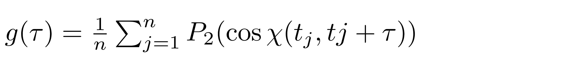

<div align="justify">

# Calculation of rotational diffusion coefficient Drot from MD trajectory

### Theoretical notes

The processing of the MD trajectory includes the following steps:

1) superpose (via the secondary-structure Cα atoms) the molecules from all MD frames onto the Ub molecule from the
   first frame

2) parameterize the above superposition operations via rotation matrices

3) construct a pseudo-molecule containing 64 vectors (emulating N-HN bonds) with near-uniform distribution on a unit
   sphere

4) apply the above rotation matrices to this pseudo-molecule (thus generating a pseudo-trajectory that encodes the
   protein’s tumbling motion)

5) evaluate the time-correlation functions g(τ) for all 64 vectors

<p align="center">
  
</p>

where P2(x) is the second-order Legendre polynomial, χ(tj,tj + τ) is the angle between the N-HN vector’s
orientations at points in time tj and tj + τ, averaging is over n pairs of time points separated by the interval τ.

7) fit G(τ) to a mono-exponential function to determine the tumbling time τrot and subsequently
calculate Drot = 1 / (6τrot). Similar to the treatment of translational diffusion, it is important to
carefully select the fitting interval. We have investigated this aspect in some depth using long MD and
BD (Brownian dynamics) simulations of ubiquitin (not shown) and concluded that <ins> in this specific case </ins> the most accurate
results are obtained when using the fitting interval [0, 2 ns] 


### Run scripts

The scripts for calculation of rotational diffusion coefficient Drot were assembeled into a pipeline using make
utility. To process your own trajectory, you need to:

1) copy the template [analysis_template](analysis_template)
2) specify the parameters in [analysis_template/common.mk](analysis_template/common.mk)
3) type make.

### Run tests

We provide the templates to analyze short 10-ns trajectory of ubiquitin (UBQ) recorded using the programm Amber. 
The purpose is to make sure that all scripts run properly. 
Because the trajectory is so short the results are moot and should not be compared with the experiment.

```code-block:: bash
   # run the script to extract Drot
   cd example
   make
```

See the [example_output](example_output)

</div>
