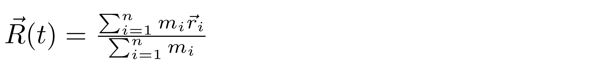

<div align="justify">

# Calculation of translational diffusion coefficient Dtr from MD trajectory

### Theoretical notes

The processing of the MD trajectory includes the following steps:

1) extract positions of the protein’s center of mass. The protein consist of i=1,..., n atoms 
with mass mi, that are located in space with coordinates ri. 
The coordinates of center of mass R(t):

<p align="center">
  
</p>

2) calculate mean square displacement (MSD(τ)) of the protein’s center of mass R(t)

<p align="center">
  
</p>

where Ri defines the protein’s center of mass, tj and tj + τ are a pair of time points
separated by the interval τ, and n is a number of such pairs within the trajectory of length x. 

3) The obtained dependencies MSD(τ) have been fitted using a linear fitting function to extract Dtr. It is important to
   choose the appropriate τ interval over which the fitting is performed. This interval should not extend to large τ
   values where the accuracy of the MSD(τ) curve suffers from increasingly poor statistics that manifests itself in
   large correlated errors. On the other hand, one can argue that small τ values should also be left out. In this
   connection, the role of internal protein dynamics is particularly relevant We have chosen the fitting
   interval [100 ps, 1 ns] to fit MSD(τ) profiles

### Run scripts

The scripts for calculation of translational diffusion coefficient Dtr were assembeled into a pipeline using make
utility. To process your own trajectory, you need to:

1) copy the template [analysis_template](analysis_template)
2) specify the parameters in [analysis_template/common.mk](analysis_template/common.mk)
3) type make.

### Run tests

We provide the templates to analyze short 10-ns trajectory of ubiquitin (UBQ) recorded with Amber package. 
Of note, the results are for demonstration purpose only and cannot be used for interpretation of Dtr of UBQ.

```code-block:: bash
   # run the script to extract Dtr
   cd example
   make
```

</div>
